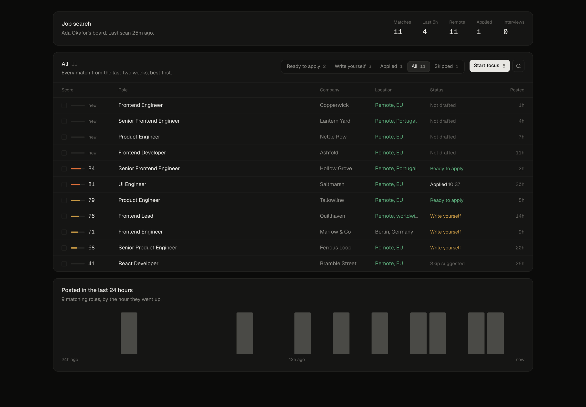
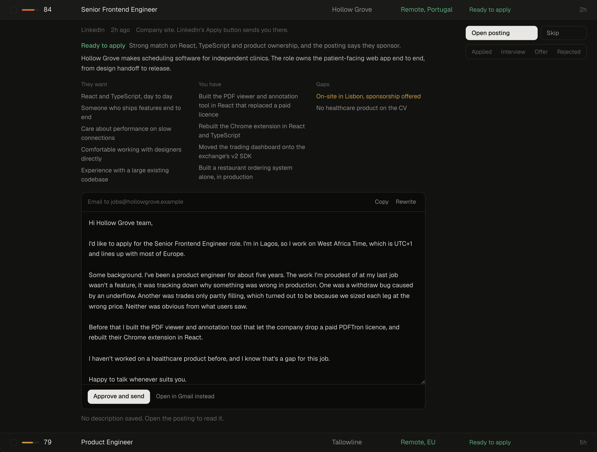
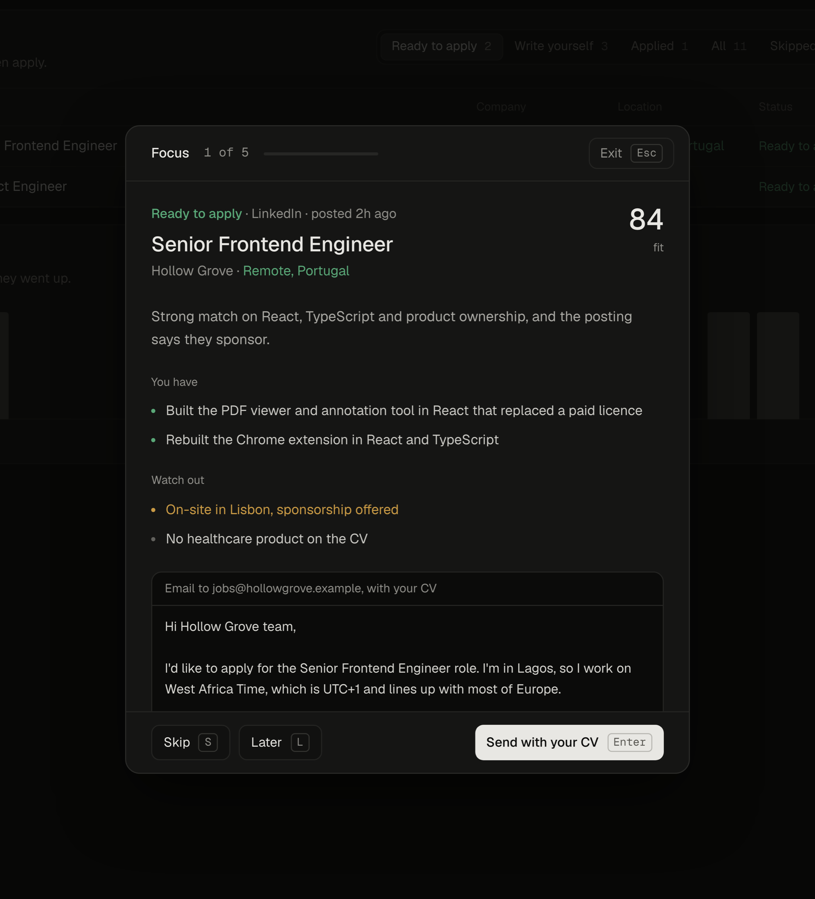
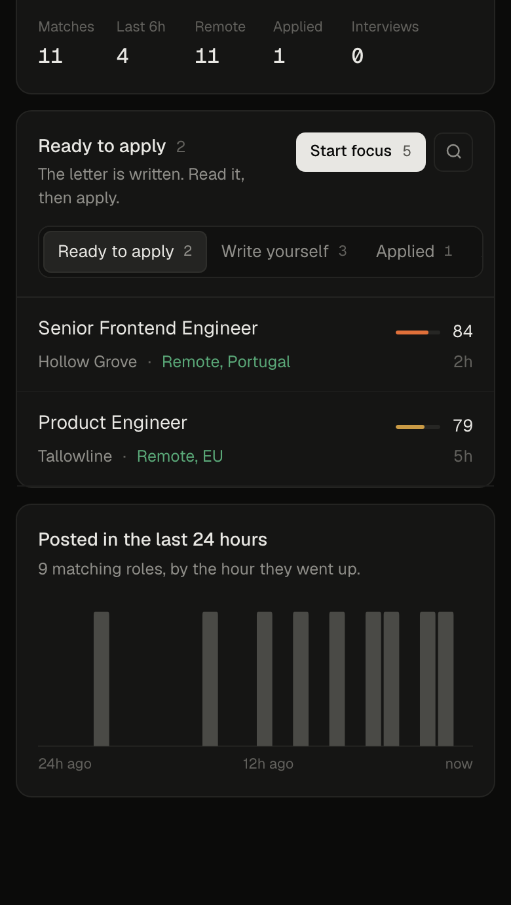

<p align="center">
  
</p>

<h1 align="center">Job search</h1>

<p align="center">
  A private job board for one person.<br>
  It finds roles every hour, writes the brief and the cover letter in your voice,<br>
  fills the application form, and tells you on whichever screen you are looking at.
</p>

<p align="center">
  <a href="#setup">Setup</a> &nbsp;·&nbsp;
  <a href="#how-it-works">How it works</a> &nbsp;·&nbsp;
  <a href="AGENT.md">AGENT.md</a>
</p>

<br>

## What you get

Every hour, a script pulls fresh roles from LinkedIn, the Hacker News hiring thread, Remotive, We Work Remotely, Working Nomads, Jobgether, Jobicy, Arbeitnow, Himalayas, Landing.jobs and the hiring pages of companies you name. It scores each one on the title, the level, where it is and whether you could take it. Only roles you could take get in, at most 30 new ones a scan. The good ones go to Claude, which writes a brief and a letter. You read, you decide, you send.

<br>

<table>
  <tr>
    <td width="50%" valign="top">
      
      <p><strong>Every role gets a brief.</strong> What the company does, what they want, what on your CV matches, what is missing, and a verdict: send as is, write it yourself, or skip. Then the letter, drafted in your voice, ready to edit or send.</p>
    </td>
    <td width="50%" valign="top">
      
      <p><strong>Focus mode.</strong> One role at a time, best fit first. Skip, Later or Apply. Apply copies the letter and opens the posting. When you come back it asks whether you did, and marks it.</p>
    </td>
  </tr>
</table>

<br>

<table>
  <tr>
    <td width="33%" valign="top">
      
    </td>
    <td width="67%" valign="top">
      <p><strong>It knows where you are.</strong> At the Mac, with the screen unlocked and not on a call, new roles appear as a small notice in Chrome. Anywhere else, your phone gets a ping through ntfy: title, company, fit, one line of why. Nothing more leaves the machine.</p>
      <p><strong>Forms filled, never sent.</strong> On any application page, one shortcut reads the form, asks the board for answers from your CV and profile, and types them in. Facts are copied, short answers are written in your voice, anything it cannot answer truthfully is left for you with a note. It never clicks submit.</p>
      <p><strong>Send from the board.</strong> When a posting gives an email address, the letter goes from your own address with your CV attached, after one confirm. Once per role, ever.</p>
    </td>
  </tr>
</table>

<br>

## The letters

They sound like you or they are useless, so the model gets three files and nothing else:

| File | What it is for |
|---|---|
| `data/cv.txt` | The only facts a letter may use. Nothing gets invented. |
| `data/profile.json` | Where you live, your timezone, whether you need a visa, what you want. |
| `data/voice.md` | Three to six lines of work worth telling, and one letter you would actually send. |

Every draft is checked for words that read as AI, retried once if it slips, and stripped of dashes. A role is "Ready to apply" only when the fit is 75 or more. That bar is in code, not in the prompt.

<br>

## Setup

You need a Mac that stays on, Node 22 or newer, Chrome, and the ntfy app on your phone. For the drafts you need one of these: an Anthropic API key (about 6 cents per role), or Claude Code or Codex logged in on the Mac. Without a key the board uses Claude Code, or Codex if that's all you have; `AI=claude` or `AI=codex` in .env.local picks one. It runs on your plan, writes 3 briefs a scan instead of 8, and works only on your own computer, not on a hosted board.

The easy way: clone this, open the folder in your coding agent and say

> Read AGENT.md and set this up with me.

It walks you through, about half an hour. By hand:

```
npm install
node bin/jobsearch.mjs init        # your facts, written to data/
node bin/jobsearch.mjs doctor      # what is still missing
node bin/jobsearch.mjs scan --hours 24 --no-draft
node bin/jobsearch.mjs dev         # http://localhost:4750
node bin/jobsearch.mjs scan        # with briefs and letters
node bin/jobsearch.mjs schedule install
```

Then load `extension/` in Chrome (chrome://extensions, Developer mode, Load unpacked) and run `node bin/jobsearch.mjs ping --test` for the phone.

<br>

## How it works

```
bin/jobsearch.mjs      the command: init, doctor, dev, scan, ping, schedule
jobsearch.config.mjs   the rules: queries, places, regions, thresholds
scripts/scan.mjs       the hourly scan
scripts/score.mjs      the rule score, and the title regexes
scripts/ping.mjs       phone pings through ntfy
lib/                   store, brief, claude, auth, mail, desk, linkedin
pages/, components/    the board (Next.js)
extension/             the Chrome extension
data/                  your files, never committed
```

The defaults are for a frontend or product engineer who lives outside the EU and can move to Portugal. Change `jobsearch.config.mjs` for your places and titles, and the regexes at the top of `scripts/score.mjs` for your kind of job.

<br>

## Privacy

Everything runs on your machine. The CV and letters go to the model that writes the brief (Anthropic, or OpenAI if you use Codex), and nowhere else. A phone ping carries the title, company, location and fit only. The board answers only on localhost unless you set a password. If you host it and run `jobsearch sync`, your CV, profile and voice are copied to your own Redis so the hosted board can draft too.
